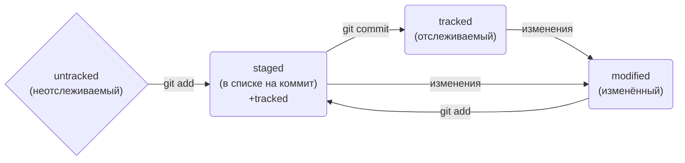

# Полезные возможности

- Команды необязательно печатать и выполнять по очереди. Можно указать их списком — разделить двумя амперсандами (&&).
- У консоли есть собственная память — буфер с несколькими последними командами. По ним можно перемещаться с помощью клавиш со стрелками вверх (↑) и вниз (↓).
- Чтобы не вводить название файла или папки полностью, можно набрать первые символы имени и дважды нажать Tab. Если файл или папка есть в текущей директории, командная строка допишет путь сама.
- Например, вы находитесь в папке dev. Начните вводить cd first и дважды нажмите Tab. Если папка first-project есть внутри dev, командная строка автоматически подставит её имя. Останется только нажать Enter.

# Создаём репозиторий с файлом.
```
cd Documents/Jupyter/ &&
mkdir "Делимся проектом с миром" &&
cd "Делимся проектом с миром" &&
git init &&
touch "Самая удобная шпаргалка.md" 
```

Этот код состоит из четырех команд, разделенных символами `&&`. Это означает, что каждая команда будет выполнена по очереди, если предыдущая команда завершилась успешно. Вот что делает каждая команда:

- `cd Documents/Jupyter/` - переходит в папку Jupyter, которая находится в папке Documents. Это папка, в которой будут храниться проекты Jupyter Notebook.
- `mkdir "Делимся проектом с миром"` - создает новую папку с именем "Делимся проектом с миром" в текущей папке. Это папка, в которой будет находиться конкретный проект, который мы хотим поделиться с миром.
- `cd "Делимся проектом с миром"` - переходит в новосозданную папку. Это папка, в которой мы будем работать над нашим проектом.
- `git init` - инициализирует пустой репозиторий git в текущей папке. Это означает, что мы можем использовать git для отслеживания изменений в нашем проекте и синхронизировать его с удаленным репозиторием на GitHub или другом сервисе.
- `touch "Самая удобная шпаргалка.md"` - создает новый пустой файл с именем "Самая удобная шпаргалка.md" в текущей папке. Это файл, в котором мы можем написать краткое описание нашего проекта и полезные советы для тех, кто хочет его воспроизвести или модифицировать. Формат файла .md означает, что он написан в разметке Markdown, которая позволяет легко форматировать текст.

# Базовые команды в консоли

Чтобы вам было удобнее взаимодействовать с командной строкой, мы подготовили шпаргалку. В ней собраны все команды, о которых мы рассказали в уроках, и их полезные вариации. 

## Навигация

- pwd (от англ. print working directory, «показать рабочую папку») — покажи, в какой я папке;
- ls (от англ. list directory contents, «отобразить содержимое директории») — покажи файлы и папки в текущей папке;
- ls -a — покажи также скрытые файлы и папки, названия которых начинаются с символа .;
- cd first-project (от англ. change directory, «сменить директорию») — перейди в папку first-project;
- cd first-project/html — перейди в папку html, которая находится в папке first-project;
- cd .. — перейди на уровень выше, в родительскую папку;
- cd ~ — перейди в домашнюю директорию (/Users/Username);
- cd / — перейди в корневую директорию.

## Работа с файлами и папками

### Создание

- touch index.html (англ. touch, «коснуться») — создай файл index.html в текущей папке;
- touch index.html style.css script.js — если нужно создать сразу несколько файлов, можно напечатать их имена в одну строку через пробел;
- mkdir second-project (от англ. make directory, «создать директорию») — создай папку с именем second-project в текущей папке.

### Копирование и перемещение

- cp file.txt ~/my-dir (от англ. copy, «копировать») — скопируй файл в другое место;
- mv file.txt ~/my-dir (от англ. move, «переместить») — перемести файл или папку в другое место.

### Чтение

- cat file.txt (от англ. concatenate and print, «объединить и распечатать») — распечатай содержимое текстового файла file.txt.

### Удаление

- rm about.html (от англ. remove, «удалить») — удали файл about.html;
- rmdir images (от англ. remove directory, «удалить директорию») — удали папку images;
- rm -r second-project (от англ. remove, «удалить» + recursive, «рекурсивный») — удали папку second-project и всё, что она содержит.

***
# **Хеш** — идентификатор коммита
- `Хеш` - идентификатор коммита в Git.
- `Хеширование` - преобразование набора данных для получения их "отпечатка".
- Хеш коммита получается с помощью алгоритма `SHA-1`.
- Хеш состоит из цифр `0-9` и латинских букв `A-F`.
- Свойства хеша: если дважды получить хеш для одного набора данных, результат будет одинаковым.
- Если изменить хоть что-то в исходных данных, хеш изменится.
- `Хеш` - основной идентификатор коммита, позволяет узнать автора, дату и содержимое закоммиченных файлов.
- Хеши и таблицу хеш → информация о коммите Git сохраняет в служебных файлах в папке .git.
***
# Исследуем лог
- Лог содержит описание коммита: хеш, автор, дата, сообщение.
- Сокращенный лог помогает быстро найти нужный коммит среди множества.
- Команда `git log --oneline` выводит сокращенный лог с хешами и комментариями.
- Уникальная длина сокращенных хешей помогает идентифицировать коммит.
***
# **HEAD** — всему голова
- Файл `HEAD` (голова, головной) указывает на последний коммит в системе git.
- Файл `HEAD` находится в папке .git.
- Для проверки содержимого файла `HEAD` можно использовать команду `cat`.
- Внутри файла `HEAD` находится ссылка на служебный файл `refs/heads/master`, содержащий хеш последнего коммита.
- При работе с Git указатель `HEAD` используется часто, его можно заменить на слово `HEAD` для передачи последнего коммита.
***
# Статусы файлов в Git
- В Git файлы могут находиться в разных состояниях: `untracked`, `staged`, `modified`, `tracked`.
- `Untracked`: новые файлы, не отслеживаемые Git.
- `Staged`: файлы после git add, в списке для коммита.
- `Modified`: файлы с изменениями относительно последней версии в `staging`.
- `Tracked`: файлы, отслеживаемые Git, включая фиксированные и добавленные в `staging`.
- Типичный жизненный цикл файла: `создание`, `изменение`, `добавление в staging`, `коммит`, `изменение`, `добавление в staging`, `коммит`.
- Git предоставляет больше контроля и гибкости в управлении версиями файлов.



***
# Как читать git status
- Типичные варианты вывода `git status`: без изменений, с найденными неотслеживаемыми файлами, с изменениями, которые не войдут в коммит, и с изменениями, которые уже попали в коммит.
- В случае изменений файла, `git status` может показать его состояние как `staged` и `modified`.
***
# Оформление сообщений к коммитам
- Оформление сообщений к коммитам в Git может подчиняться определённым правилам, которые могут быть продиктованы культурой команды или техническими ограничениями.
- В выводе команды `git log --oneline` умещается максимум 72 первых символа сообщения, поэтому многие правила включают пункт: «Сообщение не должно быть длиннее 72 символов».
- В этом уроке рассмотрим несколько популярных подходов к оформлению сообщений коммитов.
- Все люди разные и у всех есть предпочтения - в том числе, как формулировать сообщения коммитов.
- Без единообразия коммитов нет и эффективной работы в Git.
- В корпоративном стиле в начале сообщения обычно указывают Jira-ID, а после - текст сообщения.
- Conventional Commits предлагает такой формат коммита: <type>: <сообщение>.
- Для сообщений на русском языке часто рекомендуют использовать инфинитивы, а для сообщений на английском рекомендуется использовать повелительное наклонение.
***

# Шпаргалка markdown

## Выделение текста

Вы можете выделять текст в markdown с помощью символов `_` или `*`. Например:

Пример _курсива_ и **жирного** текста.

## Заголовки

Заголовки можно создавать с помощью символа `#`. Чем больше `#`, тем меньше заголовок. Например:

# Заголовок первого уровня
## Заголовок второго уровня
### Заголовок третьего уровня

## Выделение кода

Чтобы выделить текст как код, поместите его в тройные кавычки `````. 

```
mkdir my_project
cd my_project
git init
```
Это лишь некоторые функции markdown.

Вертикальные линии обозначают столбцы.

```
| Таблицы       | Это                | Круто |
| ------------- |:------------------:| -----:|
| столбец 3     | выровнен вправо    | $1600 |
| столбец 2     | выровнен по центру |   $12 |
| зебра-строки  | прикольные         |    $1 |
```

| Таблицы       | Это                | Круто |
| ------------- |:------------------:| -----:|
| столбец 3     | выровнен вправо    | $1600 |
| столбец 2     | выровнен по центру |   $12 |
| зебра-строки  | прикольные         |    $1 |

Внешние вертикальные линии (|) не обязательны, и они нужны только чтобы сам код Markdown выглядел красиво. Тот же код можно записать так:

```
Markdown | не такой | красивый
--- | --- | ---
*Но выводится* | `так же` | **клево**
1 | 2 | 3
```

Markdown | не такой | красивый
--- | --- | ---
*Но выводится* | `так же` | **клево**
1 | 2 | 3